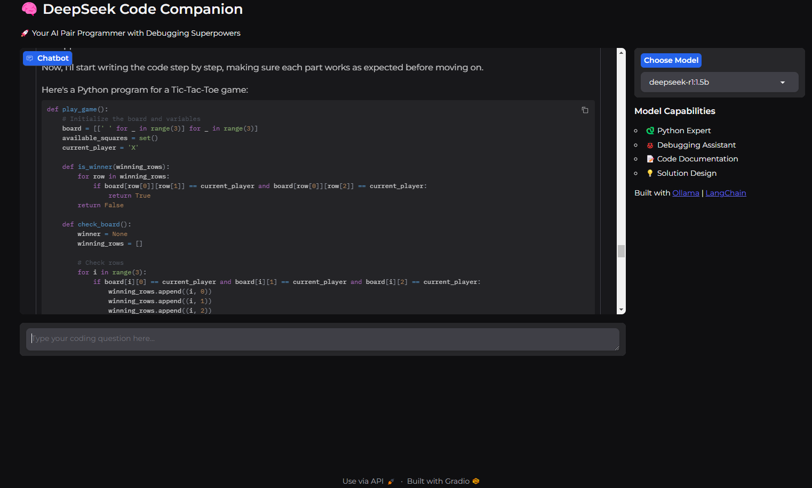

# 🧠 DeepSeek Code Companion



## 🚀 Overview

DeepSeek Code Companion is an AI-powered coding assistant that runs completely locally on your machine. Built with Gradio and powered by the DeepSeek-r1 language model through Ollama, it provides intelligent coding assistance, debugging help, and programming guidance.

## ✨ Features

- 🐍 Python Expert
- 🐞 Debugging Assistant
- 📝 Code Documentation
- 💡 Solution Design
- 🏃‍♂️ Runs 100% locally
- 🔒 Privacy-focused

## 🛠️ Prerequisites

Before running the app, make sure you have:

1. **Python 3.8+** installed on your system
2. **Ollama** installed from [ollama.com](https://ollama.com)
3. The DeepSeek model pulled (instructions below)

## 📦 Installation

1. **Clone the repository**
bash
git clone https://github.com/Rizwankaka/deepseek-r1-chat.git

cd deepseek-r1-chat

2. **Install dependencies**

```bash
pip install -r requirements.txt
```

3. **Download the DeepSeek model using Ollama**
```bash
ollama pull deepseek-r1:1.5b
```

## 🚀 Running the App

1. **Start Ollama** (if not already running)
```bash
ollama serve
```

2. **Launch the app**
```bash
python app.py
```

3. **Open your browser** and navigate to:
```
http://127.0.0.1:7860
```

## 💻 Usage

1. Select your preferred model version from the dropdown (1.5b or 3b)
2. Type your coding question in the chat input
3. Get instant, locally-processed responses for your coding queries!

## 🛠️ Built With

- [Gradio](https://www.gradio.app/) - Web interface
- [LangChain](https://langchain.com/) - LLM framework
- [Ollama](https://ollama.com/) - Local model serving
- [DeepSeek-r1](https://ollama.com/library/deepseek-r1) - Language model

## 📝 Requirements

```bash
gradio
langchain
langchain-core
langchain-ollama
```

## 🤝 Contributing

Contributions, issues, and feature requests are welcome! Feel free to check the [issues page](../../issues).

## 📜 License

This project is licensed under the MIT License - see the [LICENSE](LICENSE) file for details.

## 🙏 Acknowledgments

- DeepSeek team for the amazing model
- Ollama team for making local LLMs accessible
- LangChain team for the fantastic framework

---
⭐ If you found this project helpful, please consider giving it a star!

## 📸 Screenshot


## 🔥 Key Features Explained

### Python Expertise
The DeepSeek model is specifically fine-tuned for Python programming, offering:
- Code completion
- Bug fixing
- Best practices suggestions
- Performance optimization tips

### Debugging Assistant
- Strategic print statement suggestions
- Error analysis
- Step-by-step problem solving
- Runtime error debugging

### Code Documentation
- Automatic docstring generation
- Code explanation
- Comment suggestions
- Documentation best practices

### Solution Design
- Architecture recommendations
- Design patterns
- Code organization
- Scalability considerations

## 🚫 Common Issues & Solutions

1. **Ollama Connection Error**
   ```
   Solution: Ensure Ollama is running with 'ollama serve'
   ```

2. **Model Not Found**
   ```
   Solution: Run 'ollama pull deepseek-r1:1.5b'
   ```

3. **Port Already in Use**
   ```
   Solution: Change the port in app.launch(server_port=XXXX)
   ```

## 💡 Tips for Best Results

1. Be specific in your questions
2. Provide context when asking about code
3. Use the 1.5b model for faster responses
4. Use the 3b model for more complex tasks

## 🔄 Updates & Maintenance

Stay updated with the latest features:

```bash
git pull origin main
pip install -r requirements.txt
```

---

Made with ❤️ by Rizwan Rizwan, for the community
